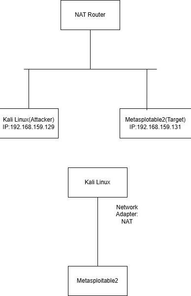

# Network Scanning & Traffic Analysis — Nmap + Wireshark

A hands-on network security project targeting an intentionally vulnerable
machine (Metasploitable2) from a Kali Linux attacker machine. The project maps
the target's attack surface with Nmap, captures and analyses the resulting
traffic in Wireshark, confirms an exploitable vulnerability, and documents how
the same activity looks from a defender's point of view.

**Tools:** Nmap 7.95 · Wireshark · Kali Linux · Metasploitable2 · VMware
**Domains:** offensive recon / enumeration · defensive traffic analysis · network security

---

## Contents

- [Overview](#overview)
- [Test Environment](#test-environment)
- [Methodology](#methodology)
- [Key findings](#key-findings)
- [Traffic analysis (Wireshark)](#traffic-analysis-wireshark)
- [Detection & defence](#detection--defence)
- [Reproducing the Results](#reproducing-the-results)
- [Repository layout](#repository-layout)
- [References](#references)
- [Authors & contribution](#authors--contribution)
- [Disclaimer](#disclaimer)

---

## Overview

The goal of this project was to practise the reconnaissance phase of a security
assessment end to end: discover a live host, enumerate its open ports and the
software behind them, fingerprint the operating system, run scripted
vulnerability checks, and — crucially — watch the network-level footprint each
of those actions leaves behind.

Nmap was used as the scanning and enumeration tool. Wireshark ran in parallel to
capture the packets generated by each scan, so that every offensive action could
be tied to a concrete, observable traffic pattern. That pairing is the core idea
of the project: an attacker's scan and a defender's alert are two views of the
same packets.

## Test Environment

Two virtual machines on an isolated NAT network inside VMware.



| Component | Detail |
|---|---|
| Attacker | Kali Linux (VMware) |
| Attacker IP | `192.168.159.129` |
| Target | Metasploitable2 |
| Target IP | `192.168.159.131` |
| Network mode | NAT (isolated) |
| Scanner | Nmap 7.95 |
| Capture | Wireshark |

Connectivity was confirmed with ICMP (`ping`) before any scanning, ensuring both
machines shared a subnet and the environment was self-contained. Tool
installation and adapter/IP configuration screenshots are in
[`screenshots/01-setup/`](screenshots/01-setup).

## Methodology

Each scan below maps to a phase of reconnaissance. Commands are the exact ones
run during this project; full output is captured in the linked screenshots and a command
reference lives in [`docs/nmap-commands.md`](docs/nmap-commands.md).

### 1. Host discovery
```bash
nmap -sn 192.168.159.131
```
Confirms the host is alive using ICMP / ARP probes before committing to a full
scan. → [`02-nmap/01-host-discovery-sn.png`](screenshots/02-nmap/01-host-discovery-sn.png)

### 2. SYN port scan
```bash
nmap -sS 192.168.159.131
```
A half-open scan that never completes the TCP handshake. Revealed **23 open TCP
ports**. → [`02-nmap/02-syn-scan-sS.png`](screenshots/02-nmap/02-syn-scan-sS.png)

### 3. Service & version detection
```bash
nmap -Pn -sV 192.168.159.131
```
Identifies the software and version behind each open port — the input for
matching services to known CVEs. → [`02-nmap/03-service-version-sV.png`](screenshots/02-nmap/03-service-version-sV.png)

### 4. OS detection
```bash
nmap -O 192.168.159.131
```
TCP/IP stack fingerprinting. The target fingerprints as Linux / Unix
(Metasploitable runs an old Ubuntu kernel). → [`02-nmap/04-os-detection-O.png`](screenshots/02-nmap/04-os-detection-O.png)

### 5. NSE scripts
```bash
nmap --script banner 192.168.159.131     # service banners
nmap --script vuln 192.168.159.131       # known-vulnerability checks
nmap --script discovery 192.168.159.131  # SMB shares, DNS, host metadata
```
Banners exposed software versions outright; the `vuln` category produced the
strongest result of the project (below). →
[`05-nse-banner.png`](screenshots/02-nmap/05-nse-banner.png) ·
[`06-nse-vuln.png`](screenshots/02-nmap/06-nse-vuln.png) ·
[`07-nse-discovery.png`](screenshots/02-nmap/07-nse-discovery.png)

## Key findings

### Open ports and services (`-sV`)

| Port | Service | Version detected |
|---|---|---|
| 21/tcp | ftp | vsftpd 2.3.4 |
| 22/tcp | ssh | OpenSSH 4.7p1 Debian 8ubuntu1 |
| 23/tcp | telnet | Linux telnetd |
| 25/tcp | smtp | Postfix smtpd |
| 53/tcp | domain | ISC BIND 9.4.2 |
| 80/tcp | http | Apache httpd 2.2.8 (Ubuntu) DAV/2 |
| 111/tcp | rpcbind | 2 (RPC #100000) |
| 139/tcp | netbios-ssn | Samba smbd 3.X – 4.X |
| 445/tcp | netbios-ssn | Samba smbd 3.X – 4.X |
| 512/tcp | exec | netkit-rsh rexecd |
| 513/tcp | login | rlogin |
| 514/tcp | shell | rsh |
| 1099/tcp | java-rmi | GNU Classpath grmiregistry |
| 1524/tcp | bindshell | Metasploitable root shell |
| 2049/tcp | nfs | 2 – 4 (RPC #100003) |
| 2121/tcp | ftp | ProFTPD 1.3.1 |
| 3306/tcp | mysql | MySQL 5.0.51a-3ubuntu5 |
| 5432/tcp | postgresql | PostgreSQL DB 8.3.0 – 8.3.7 |
| 5900/tcp | vnc | VNC protocol 3.3 |
| 6000/tcp | X11 | (access denied) |
| 6667/tcp | irc | UnrealIRCd |
| 8009/tcp | ajp13 | Apache Jserv (Protocol v1.3) |
| 8180/tcp | http | Apache Tomcat/Coyote JSP 1.1 |

### Confirmed exploitable vulnerability

The `--script vuln` run did more than flag a version — it **proved** the FTP
service was backdoored:

- **vsftpd 2.3.4 backdoor — CVE-2011-2523**
  Nmap's `ftp-vsftpd-backdoor` script triggered the backdoor and ran `id`,
  returning `uid=0(root) gid=0(root)`. This is unauthenticated remote command
  execution **as root** on the target.

It also flagged a transport-security weakness on the mail service:

- **Anonymous Diffie-Hellman key exchange (port 25, SMTP/TLS)**
  The `ssl-dh-params` script reported anonymous DH cipher suites
  (`TLS_DH_anon_WITH_AES_256_CBC_SHA`), which provide no authentication and are
  exposed to active man-in-the-middle attacks.

→ [`screenshots/02-nmap/06-nse-vuln.png`](screenshots/02-nmap/06-nse-vuln.png)

### Additional attack surface (version-identified)

Beyond the scan-confirmed finding above, several services are well-known to carry
serious CVEs based on the versions reported — e.g. the Samba `usermap_script`
RCE (CVE-2007-2447) on 139/445, the UnrealIRCd backdoor (CVE-2010-2075) on 6667,
and the legacy r-services (rexec/rlogin/rsh) on 512–514 that transmit
credentials in clear text. These are listed as exposure, not as exploits run in
this project.

## Traffic analysis (Wireshark)

Each scan was captured live. The point is to recognise reconnaissance from the
packets alone — what an analyst or IDS actually sees.

| Activity | Wireshark filter | Capture |
|---|---|---|
| Host discovery (ping) | `icmp` | [icmp](screenshots/03-wireshark/02-icmp-host-discovery.png) |
| SYN scan | `tcp.flags.syn==1` | [syn](screenshots/03-wireshark/03-syn-scan-capture.png) |
| SYN/ACK responses | `tcp.flags.syn==1 && tcp.flags.ack==1` | — |
| Vuln / discovery scripts | `tcp` | [tcp](screenshots/03-wireshark/04-tcp-vuln-capture.png) |
| SMB enumeration | `smb` | [smb](screenshots/03-wireshark/06-smb-capture.png) |
| HTTP traffic | `http` | [http](screenshots/03-wireshark/07-http-capture.png) |

A full filter cheat-sheet is in
[`docs/wireshark-filters.md`](docs/wireshark-filters.md).

**What the packets reveal**

- **ICMP** — a burst of Echo Request / Echo Reply pairs is the signature of host
  discovery. ([defender view](screenshots/03-wireshark/08-icmp-defender-view.png))
- **ARP** — when ICMP is blocked, Nmap falls back to ARP; sequential ARP requests
  across the subnet indicate internal sweeping.
  ([defender view](screenshots/03-wireshark/09-arp-defender-view.png))
- **SYN scan** — many SYN packets to many ports in a short window, with SYN/ACK
  (open) or RST (closed) replies, expose the port state without a completed
  handshake. ([defender view](screenshots/03-wireshark/10-syn-defender-view.png))

## Detection & defence

From the defender's side, the captured patterns map directly to mitigations:

- Close or filter unused ports; disable legacy services (telnet, rexec/rlogin/rsh,
  finger) in favour of authenticated, encrypted equivalents.
- Patch or replace end-of-life software — the vsftpd 2.3.4 backdoor and the
  outdated Samba/Apache/MySQL builds are the direct risk here.
- Deploy IDS/IPS rules for scan signatures: high-rate SYN fan-out, sequential ARP
  requests, and ICMP sweeps.
- Enforce strong TLS configuration (drop anonymous and export DH cipher suites).
- Segment the network so a single compromised host cannot reach everything.
- Monitor and retain packet captures / flow logs so reconnaissance is visible
  before it becomes exploitation.

## Reproducing the Results

Because raw scan output and captures are environment-specific, this repo ships a
script that regenerates them rather than committing stale files. Run it from the
Kali attacker VM against your own Metasploitable2 target:

```bash
# from the Kali attacker machine, inside the isolated test network
sudo ./scripts/recon.sh 192.168.159.131
```

`recon.sh` runs the full scan sequence, saves Nmap output in normal / XML / grepable
formats under `output/`, and captures the traffic to a `.pcap` with `tcpdump`.
You can then turn the XML into a clean summary table:

```bash
python3 scripts/parse_nmap.py output/sV.xml
```

To extract the screenshots from the source report into the
[`screenshots/`](screenshots) tree (already done if you cloned a populated repo):

```bash
python3 scripts/setup_screenshots.py
```

## Repository layout

```
.
├── README.md
├── LICENSE
├── docs/
│   ├── nmap-commands.md       # exact commands + purpose
│   └── wireshark-filters.md   # display-filter cheat sheet
├── scripts/
│   ├── recon.sh               # reproduces the full scan + pcap capture
│   ├── parse_nmap.py          # nmap XML -> markdown summary table
│   └── setup_screenshots.py   # extracts report images into screenshots/
├── screenshots/
│   ├── 01-setup/              # install, adapters, IPs, topology
│   ├── 02-nmap/               # each scan's output
│   └── 03-wireshark/          # captured traffic per filter
└── report/
    └── (original project report, .docx)
```

## References

- Lyon, G. F. — *Nmap Network Scanning* (Official Nmap Project Guide). https://nmap.org/book/
- The Nmap Project — *Nmap Reference Guide*. https://nmap.org/docs.html
- Wireshark Foundation — *Wireshark User Guide*. https://www.wireshark.org/docs/
- NIST SP 800-115 — *Technical Guide to Information Security Testing and Assessment*.
- NIST SP 800-94 — *Guide to Intrusion Detection and Prevention Systems (IDPS)*.
- MITRE — CVE-2011-2523 (vsftpd 2.3.4 backdoor). https://cve.mitre.org/cgi-bin/cvename.cgi?name=CVE-2011-2523
- RFCs: 791 (IP), 793 (TCP), 826 (ARP).

## Authors & contribution

This was a collaborative two-person project for course CY2004 at FAST-NUCES Islamabad.

- **Muhammad Subhan** (i242082)
- **Fatima Manzoor** (i242091)

The project was a cumulative effort by both authors rather than a division into
separate tasks. The scanning methodology, traffic analysis, and security
conclusions were developed jointly — both contributed ideas, and the final
results were reached through discussion and shared problem-solving. The
accompanying report was written collaboratively, with its structure and content
decided together throughout.

## Disclaimer

All scanning and exploitation was performed in a private, isolated test
environment against a virtual machine (Metasploitable2) built for this purpose.
Running these tools or
techniques against systems you do not own or have explicit written permission to
test is illegal. Use only in environments you control.
